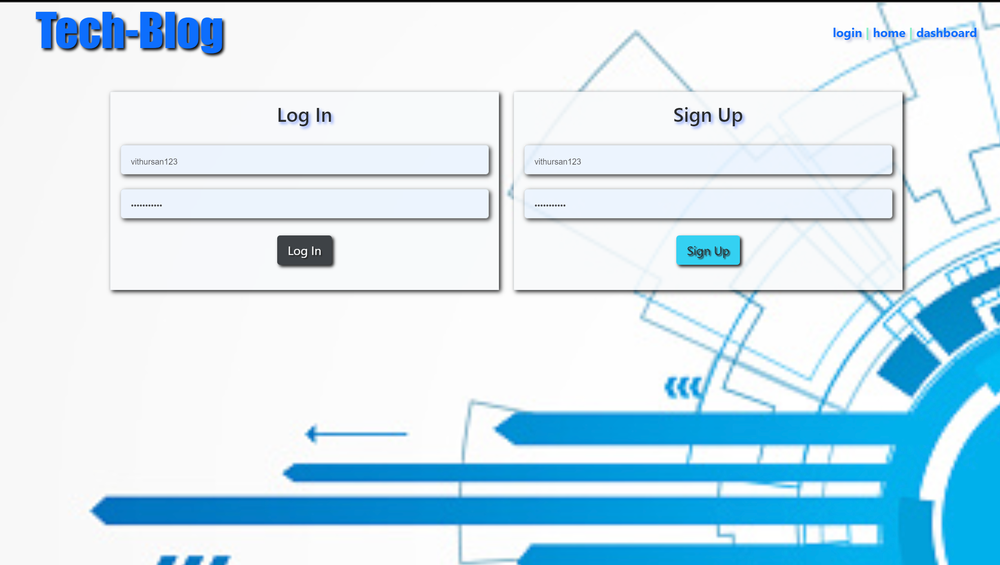
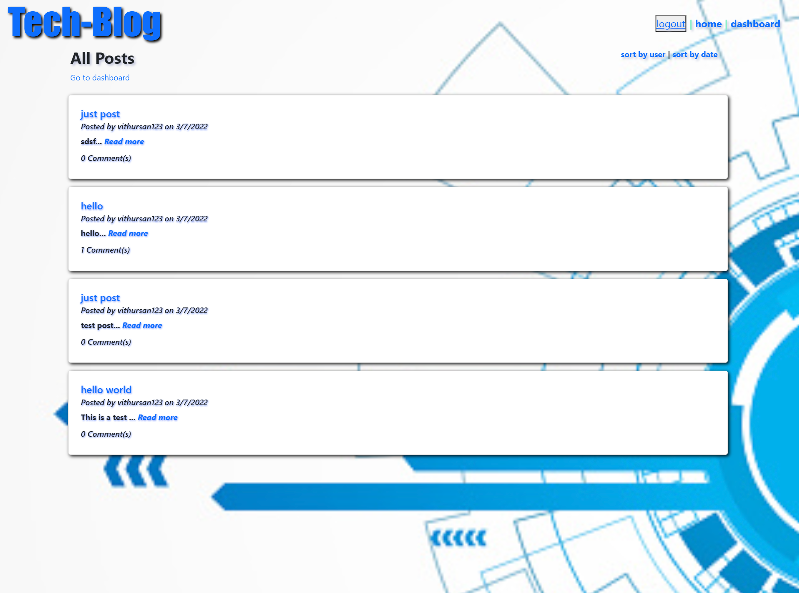
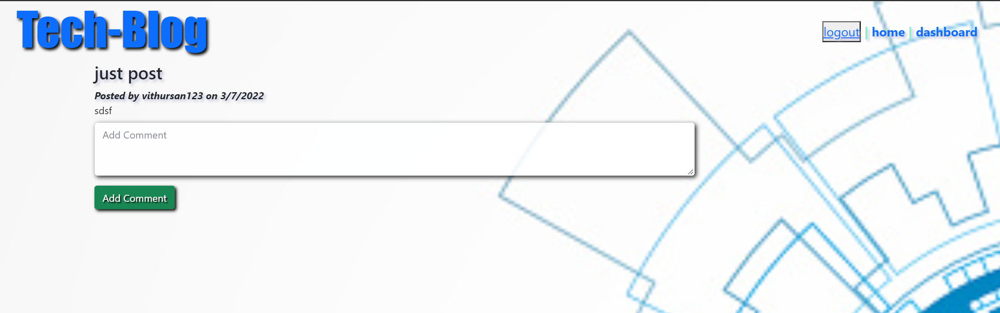
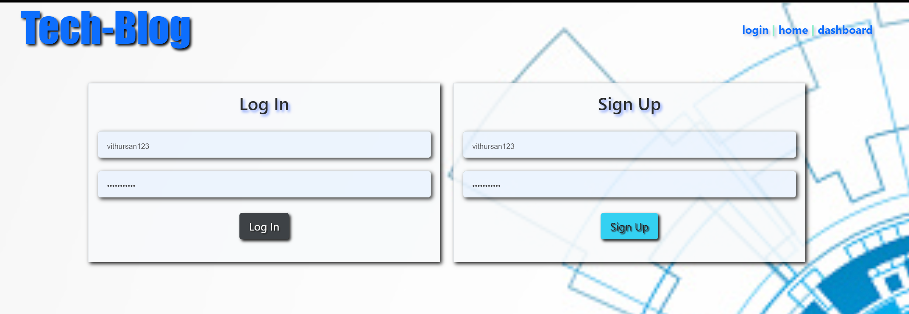

# Tech-Blog
---
 

 

---
 
 

## Description:
A mySQL blog application designed to allow users to read, browse, and post blog entries to application. The user may also comment on any posted entry. 
The application uses the Model-view-controller structure, provides a secure password protected session. Passwords are hashsed upon creation for security.
The User may view posts without an login credentials, but to create, delete, edit and comment, credentials are required.

 

---
 
 

## Usage and Installation

A deployed version of the application can be found here:

 - https://glacial-brushlands-88300.herokuapp.com/login

For local testing, download repo and please add .env file to root of app directory and in it place login credentials for the following parameters:

 - DB_NAME='blog_db'
 - DB_USER='root'
 - DB_PW='XXXX'

Save changes to .env file and deploy.

 

---
 
 

## Built With:

- Node.js
- Express.js
- Sequelize
- Bcrypt
- Handlebars
- MVC Structure
- MySQL Database
- Express Session
- Animate.style
 

---
 
 

## Screenshots

 

 

 

 

---
 
 

## Links

Deployed Application:

 - https://glacial-brushlands-88300.herokuapp.com/login

Github Repository:

 - https://github.com/vithursan6/tech-blog
 

---
 
 

## License

MIT License

Copyright (c) 2022 Vithursan6

Permission is hereby granted, free of charge, to any person obtaining a copy
of this software and associated documentation files (the "Software"), to deal
in the Software without restriction, including without limitation the rights
to use, copy, modify, merge, publish, distribute, sublicense, and/or sell
copies of the Software, and to permit persons to whom the Software is
furnished to do so, subject to the following conditions:

The above copyright notice and this permission notice shall be included in all
copies or substantial portions of the Software.

THE SOFTWARE IS PROVIDED "AS IS", WITHOUT WARRANTY OF ANY KIND, EXPRESS OR
IMPLIED, INCLUDING BUT NOT LIMITED TO THE WARRANTIES OF MERCHANTABILITY,
FITNESS FOR A PARTICULAR PURPOSE AND NONINFRINGEMENT. IN NO EVENT SHALL THE
AUTHORS OR COPYRIGHT HOLDERS BE LIABLE FOR ANY CLAIM, DAMAGES OR OTHER
LIABILITY, WHETHER IN AN ACTION OF CONTRACT, TORT OR OTHERWISE, ARISING FROM,
OUT OF OR IN CONNECTION WITH THE SOFTWARE OR THE USE OR OTHER DEALINGS IN THE
SOFTWARE.
 

---

